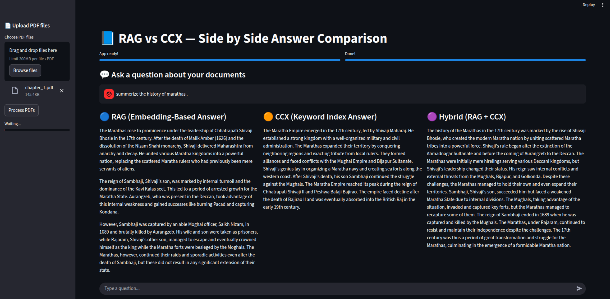

# SMALLMEM

SMALLMEM is a language model evaluation and benchmarking framework enhanced with an `index memory layer` to improve `retrieval and contextual reasoning`. It evaluates `multiple models` on a diverse set of questions using both `quantitative metrics (BLEU, ROUGE, cosine similarity, TF-IDF)` and `qualitative judge metrics (creativity, coherence, factuality, completeness, clarity)`. The `index memory layer` enables models to `reference past interactions` or `document snippets` efficiently, `enhancing accuracy and context-awareness`. SMALLMEM also provides rich visualizations—bar charts, heatmaps, scatter plots, and latency analyses—highlighting performance, efficiency, and trade-offs across models. This makes it a `powerful tool` for analyzing `small or specialized LLMs` and `understanding how memory-augmented architectures` **impact response quality**.

## Table of Contents

- [Features](#features)
- [Smallmem Evaluation Results](#smallmem-evaluation-results)
- [Pre-requisites](#pre-requisites)
- [Project Structure](#project-structure)
- [Streamlit UI](#streamlit-ui-is-also-available)
- [Results](#results)
- [About and links](#project-structure)
- [Resources](#resources)

## Demo


<!-- Fallback markdown link -->
[Download / play the demo video](img_results/video-demo.mp4)


## Features

- A RAG system using quadrant and HuggingFace embedder `BAAI/bge-m3`
- A tree-based, highly concentrated NLP text processing pipeline (context memory layer)
- A hybrid approach combining both RAG and tree-based memory
- Efficient preprocessing using `pymupdf4llm`
- Models and quadrant running locally via Docker
- Optimized performance with threading and multiprocessing
- An evaluation script to test outputs using LLMs as judges and statistical methods
- A web UI for interaction built with Streamlit
- Convenient setup and stop shell scripts for easy execution

## Smallmem Evaluation Results
| Observation Category   | Metric / Finding                           | Default                                     | RAG                                 | Index                                                                                       | Hybrid                                 |
| ---------------------- | ------------------------------------------ | ------------------------------------------- | ----------------------------------- | ------------------------------------------------------------------------------------------- | -------------------------------------- |
| **Performance**        | Overall Average Final Judge Score          | 5.24 (Highest)                              | 4.24 (Lowest)                       | 4.67                                                                                        | 4.26                                   |
| **Performance**        | Frequency as Best Performer (out of 20 Qs) | 9 questions (Most Frequent)                 | 3 questions                         | 5 questions                                                                                 | 3 questions                            |
| **Performance**        | Specialized Strength                       | Consistently High Performer                 | Low to Moderate                     | Highly effective for specific context-dependent/factual queries (e.g., Q5, Q9, Q17, Q18)    | Low to Moderate                        |
| **Performance**        | Score Differential                         | Benchmark for comparison                    | Lowest average score                | Achieved significantly higher scores than default for key questions (up to 6 points higher) | Second lowest average score            |
| **Latency Efficiency** | General Efficiency Ranking                 | Most Efficient (Lowest Latency/Score ratio) | Generally Least Efficient           | Moderate Efficiency                                                                         | Low Efficiency                         |
| **Latency Efficiency** | Trade-off                                  | Minimal latency cost for high performance   | High latency cost relative to score | Performance gains come with a moderate increase in latency relative to default              | Low score with noticeable latency cost |

- Check [Analysis notebook link here](https://www.kaggle.com/code/ayushkhaire/smallmem-evaluation)

### Pre-requisites

- Python 3.12+
- Virtual environment (recommended)
- Docker 28.5.1+ (optional, for containerized execution)
- NVIDIA GPU with CUDA 13 support (optional for accelerated inference)
- Python libraries- view requirements.txt

## Project Structure

```sh
├── app.py
├── config
│   └── logger_config.py
├── eval_assets
│   ├── ideal_answers.json
│   └── results.json
├── eval_results
│   ├── evaluation_prefixed.csv
│   ├── evaluation_prefixed.json
│   ├── evaluation_with_llm_judge.csv
│   └── evaluation_with_llm_judge.json
├── Evaluation
│   ├── engine.py
│   └── metric.py
├── Indexer
│   ├── conccontx.py
│   ├── __init__.py
│   └── tree.py
├── LLM
│   ├── conversation.py
│   ├── docker_model.py
│   ├── gemma_local.py
│   └── __init__.py
├── models.md
├── pre_processing
│   ├── __init__.py
│   ├── pdf.py
│   └── text_processor.py
├── RAG
│   ├── embeding.py
│   ├── __init__.py
│   ├── pre_processor.py
│   └── vector.py
├── README.md
├── requirements.txt
├── run_eval.py
├── scripts
│   ├── start.sh
│   └── stop.sh
├── smallmem-evaluation.ipynb
└── uploads
    └── chapter_1.pdf
```

## streamlit UI is also available
  

## Results
.png)  
.png)  
.png)  
_page-0001%20(1).jpg)  
.jpg)  
  

## About and links

**Ayush Khaire**  
[GitHub](https://github.com/AYUSHKHAIRE) | [LinkedIn](https://linkedin.com/in/ayushkhaire) | [Kaggle](https://kaggle.com/ayushkhaire)

## Resources

- **HuggingFace Embedder:** [BAAI/bge-m3](https://huggingface.co/BAAI/bge-m3)  
- **Docker Models:** [Docker Hub / Local Models Setup](https://docs.docker.com/ai/model-runner/)
- **Qdrant System:** [Qdrant vector DB](https://qdrant.tech/)  
- **CUDA ( 13 )** [Need cuda toolkit 13](https://developer.nvidia.com/cuda-downloads)